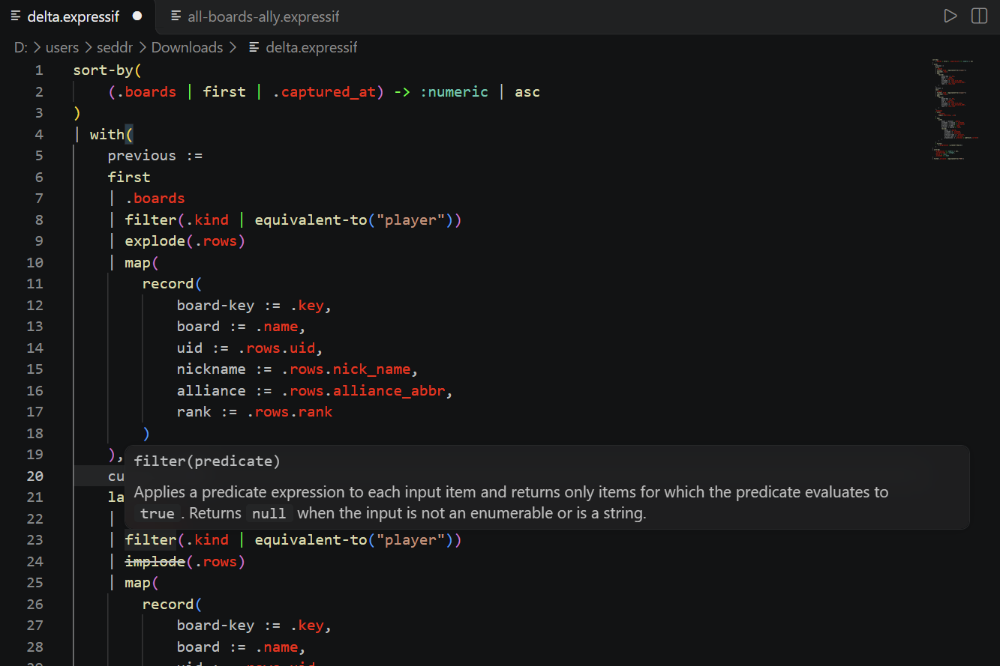

# Expressif.LanguageServer


Language Server Protocol support for [Expressif](https://github.com/Seddryck/Expressif), bringing diagnostics, completion, hover information, signature help, semantic highlighting, formatting, folding, quick fixes and expression evaluation to your editor.

The repository also contains **Expressif Language Support**, a thin Visual Studio Code client that bundles and connects to the language server.

[About](#about) | [Features](#features) | [Installing](#installing) | [Using Visual Studio Code](#using-visual-studio-code) | [Development](#development)

## About

**Social media:** [](https://seddryck.github.io/Expressif.LanguageServer)
[](https://twitter.com/Seddryck)

**Releases:** [](https://github.com/seddryck/expressif.LanguageServer/releases/latest)
[](https://github.com/Seddryck/Expressif.LanguageServer/releases/latest) [](https://github.com/Seddryck/Expressif.LanguageServer/blob/master/LICENSE)

**Dev. activity:** [](https://github.com/Seddryck/Expressif.LanguageServer/commits)


**Continuous integration builds:** [](https://github.com/Seddryck/Expressif.LanguageServer/actions/workflows/build.yml)
[](https://www.codefactor.io/repository/github/seddryck/Expressif.LanguageServer)
[](https://codecov.io/github/Seddryck/Expressif.LanguageServer)
<!-- [](https://app.fossa.com/projects/git%2Bgithub.com%2FSeddryck%2FExpressif.LanguageServer?ref=badge_shield) -->

**Status:** [](https://github.com/Seddryck/Expressif.LanguageServer/stargazers)
[](https://github.com/Seddryck/Expressif.LanguageServer/issues?utf8=%E2%9C%93&q=is:issue+is:open+label:bug+)
[](https://github.com/Seddryck/Expressif.LanguageServer/search?l=C%23)

## Features

Expressif.LanguageServer exposes editor-independent language features through the Language Server Protocol.

| Feature | Status | Description |
| --- | --- | --- |
| Diagnostics | ✅ | Reports syntax errors, invalid function calls, lifecycle/deprecation warnings and supported migration warnings. |
| Function completion | ✅ | Completes Expressif functions and aliases using the shared function catalog. |
| Hover | ✅ | Shows function information and contextual information for fields and input bindings. |
| Signature help | ✅ | Shows function signatures and the active parameter while editing calls. |
| Semantic highlighting | ✅ | Provides semantic tokens for Expressif language constructs. |
| Document highlights | ✅ | Highlights relationships between field references or positional tuple references and their supplying expressions or tuple elements. |
| Document formatting | ✅ | Formats complete documents or safe, complete syntax within a selection using the server's canonical formatting rules. |
| Folding | ✅ | Provides syntax-aware folding for multiline pipelines, delimited expressions, input-bound bodies and block comments. |
| Quick fixes | ✅ | Offers supported replacements for deprecated functions, legacy tuple references and binding migrations. |
| Expression evaluation | ✅ | Evaluates a selection or complete Expressif document with optional input data. |
| On-type formatting | Planned | Tracked by [#67](https://github.com/Seddryck/Expressif.LanguageServer/issues/67). |
| Type-aware completion ranking | Planned | Tracked by [#58](https://github.com/Seddryck/Expressif.LanguageServer/issues/58). |
| Go to definition / references / rename | — | Not currently implemented. |



The language server communicates with editors over standard input and output. Editor-specific behavior belongs in thin clients such as the VS Code extension.

## Installing

### Visual Studio Code

The recommended way to use Expressif.LanguageServer today is through the **Expressif Language Support** VS Code extension.

Download the `.vsix` package from the [latest GitHub release](https://github.com/Seddryck/Expressif.LanguageServer/releases/latest), then install it from **Extensions → … → Install from VSIX…**.

Choose the VSIX matching your platform:

| Platform | VSIX target |
| --- | --- |
| Windows x64 | `win32-x64` |
| Linux x64 | `linux-x64` |
| macOS Apple Silicon | `darwin-arm64` |

It can also be installed from the command line:

```powershell
code --install-extension ./Expressif-LanguageSupport-<version>-<target>.vsix
```

The packaged extension contains a self-contained language server. A separate .NET installation or language-server installation is therefore not required.

### Standalone language server

A standalone self-contained server is also available from the [GitHub releases](https://github.com/Seddryck/Expressif.LanguageServer/releases).

Download the archive matching your platform:

```text
Expressif-LanguageServer-<version>-net10.0-win-x64.zip
Expressif-LanguageServer-<version>-net10.0-linux-x64.tar.gz
Expressif-LanguageServer-<version>-net10.0-osx-arm64.tar.gz
```

Then configure an LSP-compatible editor or client to launch `Expressif-LanguageServer.exe`
on Windows or `Expressif-LanguageServer` on Linux and macOS. The process communicates using
the Language Server Protocol over standard input and output; it is not an interactive command-line
application.

The Linux package targets glibc-based x64 distributions. The macOS package targets Apple Silicon.

## Using Visual Studio Code

Open a `.expressif` or `.expr` file after installing the extension. The language server starts automatically and provides diagnostics, completion, hover information, signature help, semantic highlighting, formatting, folding and quick fixes.

### Format and fold expressions

Run **Format Document** from an Expressif editor to format the complete document, or select complete Expressif syntax and run **Format Selection** to format only that selection. Partial or unsafe selections are left unchanged.

From the Explorer, right-click a `.expressif` or `.expr` file and run **Expressif: Format Document** to format it without opening it first.

VS Code displays folding controls automatically for multiline pipelines, delimited expressions and literals, input-bound expression bodies, and block comments.

### Run an expression

Press `Ctrl+Shift+Enter` (`Cmd+Shift+Enter` on macOS), select the play button in the editor title,
or run **Expressif: Run Expression** from the Command Palette to choose the input and output format.

If text is selected, only that selection is evaluated. Otherwise, the complete document is evaluated.

The input picker supports no input, an Expressif literal, a JSON or CSV file, an open JSON/CSV editor, the current selection in such an editor, or the previously used input.

After choosing the input, choose the result representation:

```text
.expressif
.json
```

Evaluation results open as read-only virtual documents beside the Expressif script. `.expressif`
results use Expressif language mode and `.json` results use JSON language mode. Re-running the
same script with the same output format refreshes the existing result editor.

Press `Ctrl+Enter` (`Cmd+Enter` on macOS), or run **Expressif: Run Expression with Last Input and Output**, to evaluate using the most recently selected input and output format. If either choice is unavailable, only the missing choice is requested.

### Configuration

The VS Code extension exposes these settings:

| Setting | Description |
| --- | --- |
| `expressif.languageServer.path` | Optional path to a separately installed language-server executable. When empty, the bundled server is used. |
| `expressif.output.formatting` | Evaluation result rendering: `compact` (the default) or `pretty`. |
| `expressif.output.indent` | Spaces per indentation level for `pretty` evaluation results. Defaults to `2` and does not affect compact rendering. |
| `expressifLanguageServer.trace.server` | LSP tracing level: `off`, `messages` or `verbose`. |

To change evaluation rendering, open VS Code Settings (`Ctrl+,` or `Cmd+,`), search for
`Expressif Output`, and choose **compact** or **pretty**. When **pretty** is selected, set
**Expressif › Output: Indent** to the number of spaces to use at each level. The equivalent
`settings.json` configuration is:

```json
{
  "expressif.output.formatting": "pretty",
  "expressif.output.indent": 4
}
```

Change `pretty` to `compact` for single-line results. The indent setting is ignored in compact
mode. Changes apply to the next evaluation without reloading VS Code.

Language-server logs and protocol traces are available from **View → Output → Expressif Language Server**.

## Current limitations

Some pieces of the editor experience are deliberately still evolving.

The language-server extension currently owns the `expressif` language registration itself. [#117](https://github.com/Seddryck/Expressif.LanguageServer/issues/117) will make it depend on the dedicated Expressif syntax-highlighting extension instead.

Completion is currently based on the function catalog rather than inferred input types. Type-aware ranking is tracked by [#58](https://github.com/Seddryck/Expressif.LanguageServer/issues/58).

Whole-document and selection formatting are available, while formatting as you type is tracked separately by [#67](https://github.com/Seddryck/Expressif.LanguageServer/issues/67).

Additional semantic validation and editor assistance for tuple-binding shorthands is tracked by [#102](https://github.com/Seddryck/Expressif.LanguageServer/issues/102).

## Development

Development requires the .NET 10 SDK, Node.js with npm, and Visual Studio Code.

Build and test the language server from the repository root:

```powershell
dotnet restore Expressif.LanguageServer.sln
dotnet build Expressif.LanguageServer.sln -c Release -f net10.0
dotnet test Expressif.LanguageServer.sln -c Release -f net10.0
```

Build the VS Code client with:

```powershell
cd vscode-extension
npm ci
npm run compile
```

For a local extension-development session, publish a self-contained server into the extension first:

```powershell
node ./scripts/publish-server.mjs
```

Then open the repository in VS Code and press **F5** to launch the Extension Development Host.

The VS Code client is intentionally thin: parsing, diagnostics and language semantics remain in `Expressif.LanguageServer` and its Core project rather than being duplicated in TypeScript.

## Contributing

See [CONTRIBUTING.md](CONTRIBUTING.md) for contribution guidelines and [SECURITY.md](SECURITY.md) for reporting security issues.

Expressif.LanguageServer is licensed under the [Apache License 2.0](LICENSE).
